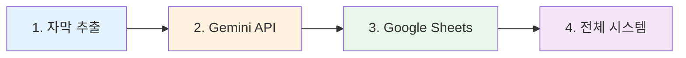

# YouTube Channel Monitor & AI Summary System

## 🧪 단계별 테스트 가이드

전체 시스템을 실행하기 전에 각 기능을 독립적으로 테스트하세요. 문제가 발생하면 해당 단계만 반복 테스트할 수 있습니다.

---

## 테스트 순서



---

## 1️⃣ YouTube 자막 추출 테스트

YouTube 동영상에서 자막을 추출하는 기능을 테스트합니다.

### 실행 방법

```bash
npm start -- <YouTube_URL> <언어코드>
```

### 예시

```bash
# 한국어 자막 추출
npm start -- https://www.youtube.com/watch?v=dQw4w9WgXcQ ko

# 영어 자막 추출
npm start -- https://www.youtube.com/watch?v=dQw4w9WgXcQ en
```

### 예상 출력 (성공)

```
🎬 Starting YouTube Subtitle Extractor...
Video ID: dQw4w9WgXcQ
Language: ko

✅ 자막 추출 완료!
[자막 내용이 콘솔에 출력됨]
```

### 성공 조건
- ✅ 자막이 추출되어 콘솔에 출력됨
- ✅ 에러 없이 완료

### 실패 시 확인
- 동영상에 해당 언어의 자막이 있는지 확인
- YouTube URL이 올바른지 확인
- 인터넷 연결 확인

---

## 2️⃣ Gemini API 연동 테스트

Gemini AI 모델 확인 및 텍스트 요약 기능을 테스트합니다.

### 실행 방법

```bash
npx tsx tests/test-gemini.ts
```

### 테스트 내용

1. **모델 목록 조회**: 사용 가능한 Gemini 모델 확인
2. **요약 테스트**: 샘플 텍스트로 AI 요약 생성

### 예상 출력 (성공)

```
🧪 Gemini API 통합 테스트

📋 1단계: 사용 가능한 Gemini 모델 확인
✅ 총 50개 모델 중 generateContent 지원: 34개

📝 주요 추천 모델:
   ✓ models/gemini-2.5-flash
   ✓ models/gemini-2.5-pro
   ✓ models/gemini-2.0-flash

🤖 2단계: Gemini API 텍스트 요약 테스트
✅ 요약 성공!

📥 원문:
[샘플 텍스트]

📝 요약 결과:
[AI가 생성한 요약]

✅ 모든 테스트 통과! Gemini API가 정상적으로 작동합니다.
```

### 성공 조건
- ✅ 모델 목록이 표시됨 (예: models/gemini-2.5-flash)
- ✅ 샘플 텍스트가 성공적으로 요약됨

### 실패 시 확인

- `.env` 파일에 `GEMINI_API_KEY`가 설정되어 있는지
- API 키가 `AIza`로 시작하는지 (올바른 형식)
- [Google AI Studio](https://aistudio.google.com)에서 키가 활성화되어 있는지

---

## 3️⃣ Google Sheets 연동 테스트

Google Sheets 접근, 헤더 생성, 데이터 추가 기능을 테스트합니다.

### 실행 방법

```bash
npx tsx tests/test-sheets.ts
```

### 테스트 내용

1. **Service Account 확인**: 키 파일 및 이메일 확인
2. **스프레드시트 접근**: 권한 및 시트 목록 조회
3. **헤더 작업**: 헤더 행 읽기/쓰기
4. **데이터 추가**: 테스트 데이터 삽입

### 예상 출력 (성공)

```
🧪 Google Sheets 통합 테스트

🔍 1단계: Google Sheets 연결 테스트
✅ Service Account 키 파일 존재
✅ Service Account 이메일: your-service@project.iam.gserviceaccount.com
✅ Spreadsheet ID: 1ABC...XYZ

📡 스프레드시트 접근 시도 중...
✅ 스프레드시트 접근 성공!
   제목: My Spreadsheet
   시트 개수: 2

📋 사용 가능한 시트 목록:
   1. 시트1 (ID: 0)
   2. Sheet2 (ID: 123456)

📝 2단계: 헤더 읽기/쓰기 테스트
✅ "시트1" 시트 존재 확인
✅ 헤더 작성 완료

➕ 3단계: 테스트 데이터 추가
✅ 데이터 추가 성공!

✅ 모든 테스트 통과! Google Sheets 연동이 정상적으로 작동합니다.
```

### 성공 조건

- ✅ 스프레드시트 접근 성공
- ✅ 시트 목록이 표시됨
- ✅ 헤더 행 생성 또는 확인됨
- ✅ 테스트 데이터가 스프레드시트에 추가됨

### 실패 시 확인

**404 에러: "Spreadsheet not found"**
- `.env`의 `GOOGLE_SHEETS_SPREADSHEET_ID` 확인
  - `d/`가 포함되지 않았는지 확인
  - ❌ 잘못: `d/1ABC...XYZ`
  - ✅ 올바름: `1ABC...XYZ`
- 스프레드시트가 삭제되지 않았는지 확인

**403 에러: "Permission denied"**
1. Google 스프레드시트 열기
2. 우측 상단 **"공유"** 버튼 클릭
3. Service Account 이메일 추가
   - `service-account-key.json` 파일에서 `client_email` 확인
   - 예: `youtube-monitor@project.iam.gserviceaccount.com`
4. 권한을 **"편집자"**로 설정
5. **"공유"** 클릭

**400 에러: "Unable to parse range: Sheet1!A1:F1"**
- `.env`의 `GOOGLE_SHEETS_SHEET_NAME`이 실제 시트 이름과 일치하는지 확인
- 테스트 스크립트가 표시하는 시트 목록 참고
- 예: `Sheet1` → `시트1` (한글/영문 확인)

---

## 4️⃣ 전체 시스템 통합 테스트

모든 개별 테스트가 통과하면 전체 시스템을 실행합니다.

### 실행 방법

```bash
npm run monitor
```

### 동작 과정

1. 📺 YouTube 채널에서 새 동영상 확인
2. 🔍 자막 추출
3. 🤖 Gemini AI로 요약 생성
4. 📊 Google Sheets에 결과 저장

### 예상 출력 (성공)

```
🚀 YouTube 채널 모니터링 시작...

📺 모니터링 대상 채널: 1개
📊 채널당 확인할 최대 동영상 수: 10개

🆕 새로운 동영상: 1개

📹 처리 중: [동영상 제목]
   채널: 채널명
   게시일: 2025. 12. 5.
   🔍 자막 추출 중...
   ✅ 자막 추출 완료: 1234개 세그먼트
   🤖 AI 요약 생성 중...
   ✅ 요약 완료
   📊 구글 시트 업데이트 중...
   ✅ 구글 시트에 추가됨

============================================================
📊 처리 결과 요약
============================================================
✅ 성공: 1개
❌ 실패: 0개
📝 총 처리: 1개
============================================================
```

### 성공 조건

- ✅ 새 동영상 감지
- ✅ 자막 추출 성공
- ✅ AI 요약 생성 성공
- ✅ Google Sheets 업데이트 성공

### 자동 모니터링 (1시간마다)

```bash
npm run monitor:watch
```

---

## 🔧 일반적인 문제 해결

### 문제 1: Gemini API 404 에러

```
models/gemini-xxx is not found for API version v1beta
```

**단계:**
1. `npx tsx tests/test-gemini.ts` 실행
2. 사용 가능한 모델 확인
3. 필요시 `src/aiSummarizer.ts`의 모델 이름 업데이트

---

### 문제 2: Service Account 키 파일 없음

```
Failed to initialize Google Sheets client
```

**단계:**
1. [SETUP.md](./SETUP.md)의 "2.4 Service Account JSON 키 다운로드" 참고
2. JSON 키 파일을 프로젝트 루트에 `service-account-key.json`으로 저장
3. `.env`의 `GOOGLE_SERVICE_ACCOUNT_KEY_PATH` 확인

---

### 문제 3: YouTube 자막 없음

```
자막을 찾을 수 없습니다
```

**원인:**
- 동영상에 자막이 없거나 비활성화됨
- 시스템이 자동으로 건너뛰고 다음 동영상 처리

**확인:**
- YouTube에서 직접 자막 확인 (설정 → 자막)
- 다른 동영상으로 테스트

---

## 💡 테스트 팁

### 빠른 디버깅 순서

```bash
# 1. 환경 변수 확인
cat .env

# 2. 각 기능 개별 테스트
npx tsx tests/test-gemini.ts
npx tsx tests/test-sheets.ts

# 3. 문제가 없으면 전체 실행
npm run monitor
```

### 로그 확인

각 테스트 스크립트는 상세한 로그를 출력합니다:
- ✅ 성공 메시지
- ❌ 에러 메시지 및 상세 정보
- 💡 해결 방법 제안

### 파일 위치

```
youtube-script/
├── tests/
│   ├── test-gemini.ts      # Gemini API 테스트
│   └── test-sheets.ts      # Google Sheets 테스트
├── src/
│   ├── monitor.ts          # 전체 시스템
│   ├── aiSummarizer.ts     # AI 요약
│   └── sheetsManager.ts    # Sheets 연동
├── TESTING.md              # 이 문서
└── SETUP.md                # 초기 설정 가이드
```

---

## 📞 추가 도움

- 초기 설정: [SETUP.md](./SETUP.md)
- 전체 프로젝트 정보: [README.md](./README.md)
- GitHub Issues: 문제 발생 시 이슈 등록
